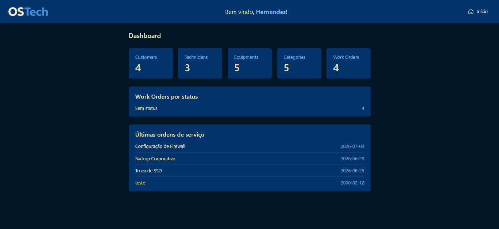
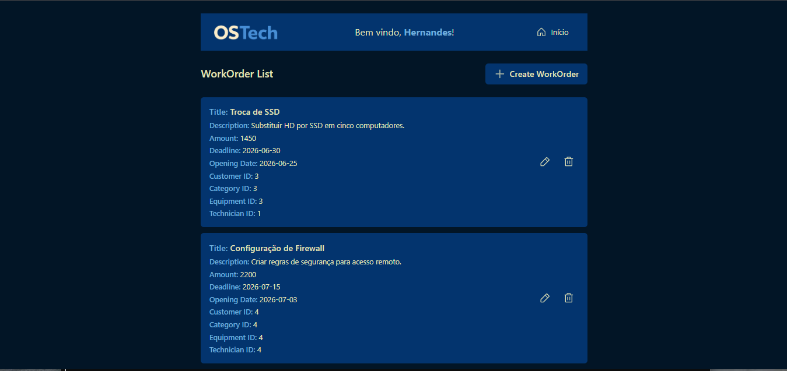
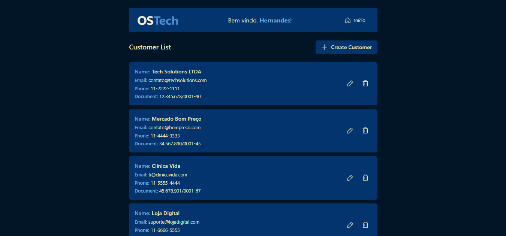
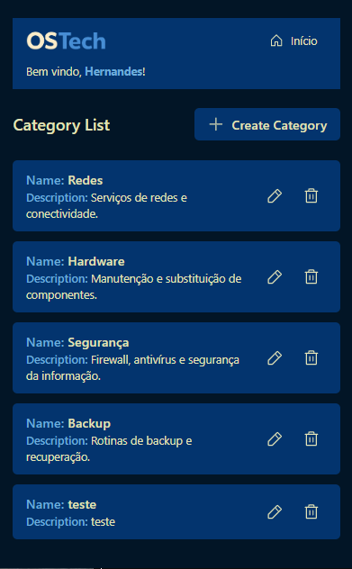

# OSTech — React

Frontend for the **OSTech** platform, a service order management system built with React and integrated with a REST API in ASP.NET Core.

Built to consolidate concepts in React, API consumption with TanStack Query, componentization, validation, responsiveness, and frontend application organization.

---

## 📸 Screenshots

### Dashboard


### Work Orders


### Customer List


### Responsive — Mobile


---

## 📌 About the project

OSTech manages:

- Categories
- Customers
- Technicians
- Equipment
- Work Orders

The application covers complete **CRUD** operations, relationships between entities, form validation, API error handling, visual feedback, and navigation between pages.

---

## 🚀 Features

### Dashboard
- Totals per entity: customers, technicians, equipment, categories, work orders
- Work orders by status

### Categories / Customers / Equipment / Technicians
- Listing with TanStack Query
- Creation with `useMutation`
- Editing with `useMutation`
- Deletion with `useMutation`
- Automatic query invalidation after changes
- Data validation
- Visual feedback on operations

### Technicians
- Availability control (boolean)

### Work Orders
- Listing, creation, editing, deletion via TanStack Query
- Relationship with customer, technician, category, and equipment
- Data validation before submission
- Handling of errors returned by the API

### Navigation
- React Router with routes for all entities
- Home page with access to all entities
- 404 page for non-existent routes
- Return-to-home button on internal pages

---

## 🛠️ Tech stack

### Frontend
- React
- React Router
- Tailwind CSS
- TanStack Query
- Axios
- React Toastify
- Phosphor Icons

### Backend
- ASP.NET Core (Web API)

> The backend is a separate project, consumed by the frontend via HTTP.

---

## 🧱 Architecture

API calls are organized per entity in independent services:

- `categoryService`
- `customerService`
- `equipmentService`
- `technicianService`
- `workOrderService`

Components and pages use these services together with TanStack Query, keeping API communication separate from the UI layer.

---

## 📂 Project structure

```text
src/
├── components/
│   ├── Buttons/
│   ├── Container/
│   ├── EmptyState/
│   ├── ErrorState/
│   ├── Header/
│   ├── Loading/
│   ├── Modal/
│   └── ...
│
├── hooks/
│   ├── useModals.js
│   └── useRequestState.js
│
├── pages/
│   ├── Home/
│   ├── Dashboard/
│   ├── Category/
│   ├── Customer/
│   ├── Equipment/
│   ├── Technician/
│   ├── WorkOrder/
│   └── NotFound/
│
├── services/
│   ├── api.js
│   ├── categoryService.js
│   ├── customerService.js
│   ├── equipmentService.js
│   ├── technicianService.js
│   └── workOrderService.js
│
├── validations/
│   ├── categoryValidation.js
│   ├── customerValidation.js
│   ├── equipmentValidation.js
│   ├── technicianValidation.js
│   └── workOrderValidation.js
│
├── utils/
│   └── apiError.js
│
├── routes.jsx
├── Global.css
└── index.jsx
```

---

## 🧩 Componentization

Reusable components used across entity pages:

- `Container`, `Header`, `Loading`, `EmptyState`, `ErrorState`
- `Modal` (generic, with internal scroll for large forms)
- `CreateButton`, `ActionsButtons`

Modals for each entity are split by responsibility (`Create*`, `Edit*`, `Delete*`), keeping page components leaner.

---

## 🔄 Data management

TanStack Query is used to:

- Fetch data with `useQuery`
- Create records with `useMutation`
- Update records with `useMutation`
- Delete records with `useMutation`
- Invalidate queries after changes
- Cache queries
- Automatic refetch after invalidation
- Control loading and error states directly through queries/mutations

---

## 🔄 Custom hooks

- **`useModals`** — centralizes the open/close state of create, edit, and delete modals (`isCreateOpen`, `isEditOpen`, `isDeleteOpen` + `open*`/`close*` functions).
- **`useRequestState`** — centralizes the validation state still needed on the pages (`errors`/`setErrors`), since loading, submitting, and request errors are now handled by TanStack Query.

---

## 🔗 Relationships

A Work Order relates to a Customer, Technician, Category, and Equipment. On creation/editing, the user selects related entities via `<select>`, and the corresponding IDs are sent in the payload:

```json
{
    "customerId": 1,
    "technicianId": 2,
    "categoryId": 3,
    "equipmentId": 4
}
```

---

## ✅ Validation

Each entity has its own validation function (`validations/`), run before the request is sent to the API. Errors are stored in state and shown next to the corresponding field:

```javascript
const validationErrors = validateWorkOrder(workOrder);

if (Object.keys(validationErrors).length > 0) {
    setErrors(validationErrors);
    return;
}
```

---

## ⚠️ Error handling

API errors are interpreted by a central utility:

```javascript
getApiErrorMessage(error)
```

And displayed via toast:

```javascript
toast.error(getApiErrorMessage(error));
```

---

## 🔔 Visual feedback

React Toastify is used to confirm creation, editing, deletion, and to report operation errors.

---

## 📱 Responsiveness

The interface was reviewed for different screen sizes, with particular attention to devices starting at **360px**.

Reviewed areas:

- Header and navigation
- Dashboard
- Listings
- Forms
- Modals
- Cards and action buttons
- Spacing and visual hierarchy

---

## ⚙️ How to run

### Prerequisites

- Node.js and npm
- OSTech API backend running

### Steps

```bash
git clone https://github.com/Hernandessn/ostech-workorder-system.git
cd ostechreact
npm install
npm start
```

Configure the API URL in `src/services/api.js` according to your local environment.

---

## 📚 Project goals

- Practice React on a project of real-world scale
- Consume a custom REST API
- Work with CRUD, entity relationships, and form validation
- Migrate async state management to TanStack Query
- Build custom hooks to reduce duplication across pages
- Build a responsive interface with Tailwind CSS

---

## 📄 License

Project developed for educational and portfolio purposes.